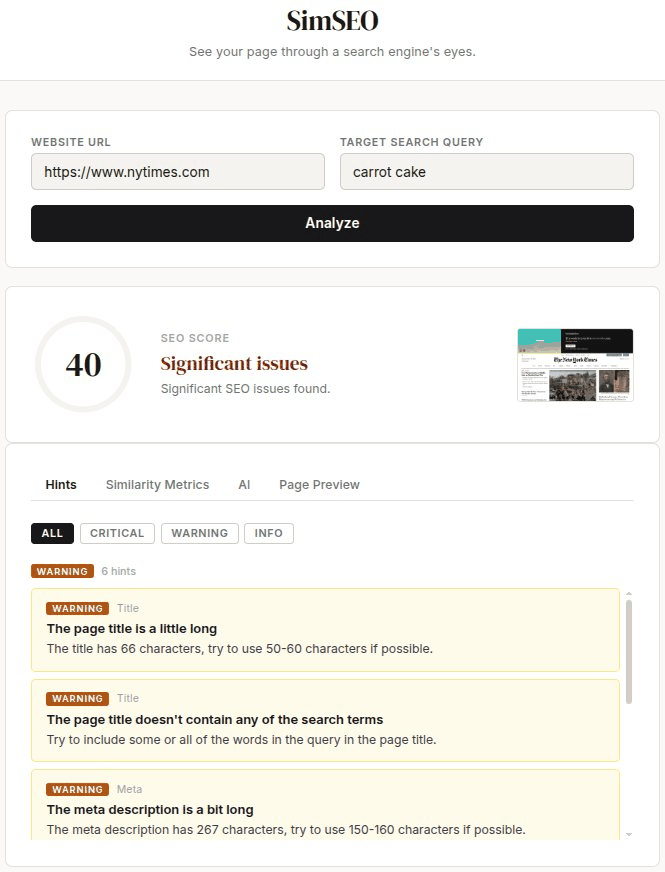

# SimSEO

SimSEO is a follow-up to [https://github.com/ccoughlin/simsites](simsites), centered around ideas about using LLMs in a vendor-agnostic way to aid in Search Engine Optimization (SEO).  SimSEO takes the basic approach and fleshes it out into a (hopefully) useful web app.

Don't want to use AI? No problem! SimSEO also provides some simple checks and relevancy metrics.  These are all computed locally, so your data never leaves the system.  Later on if you decide you'd like to try the AI features out, BYOK (Bring Your Own Key) and you're good to go.

## Installation
1.  (Optional) Setting up a new Python environment is recommended, but not required e.g. `python -m venv simseo_venv; source simseo_venv/bin/activate`.

2.  Install the dependencies:
`pip install -r requirements.txt`

3.  (Optional) Install the dependencies for running the unit tests:
`pip install -r requirements-dev.txt`

4.  (Optional) if you want to use the AI features, you'll need a [Tavily](https://www.tavily.com/) account for search and an API key from an LLM provider (OpenAI and Mistral are currently supported).  Once you have the keys, simply add them to the environment e.g.

`export TAVILY_API_KEY="<your Tavily API KEY>"`

and

`export LLM_API_KEY="<your LLM API KEY>`

5.  Start the web app with e.g.

`uvicorn main:app --reload`

and open [http://localhost:8000/](http://localhost:8000/) in your browser of choice.